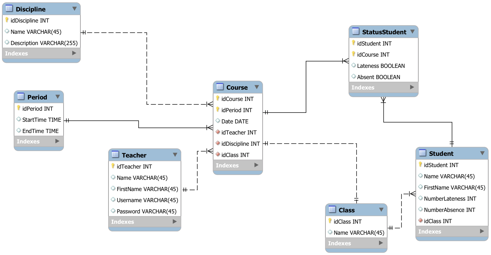

# ManagerLatenessAbsence :: Manage delays and absences of students in a class

Authors: Loan Lassalle and Stéphane Martignier
***

## Purpose

The goal of this project is to be able to display the trombinoscope of the class and via this interface to manage the delays and absences of each student. Teachers will have secure access via a user account and password. The data will be stored in a database.

## Objectives

* Teacher authentication
* Display of the teachers' timetable
* Displaying the class trombinoscope
* Linking the program with databases
* Recording of student delays and absences

## Relational model

  

